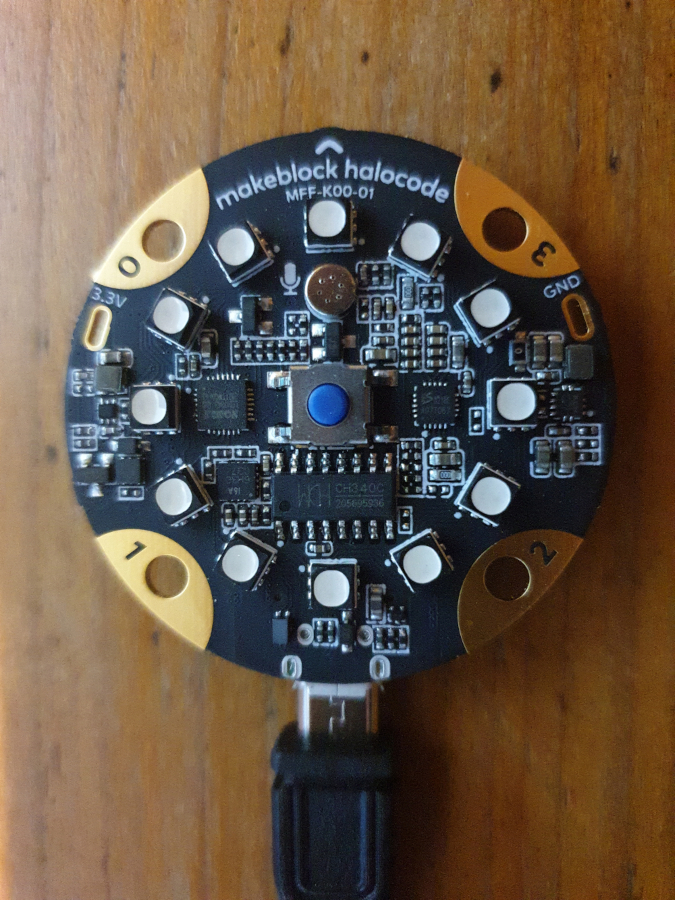

# halocode-tools

Upload and log script for the [makeblock halocode MFF-K00-01](https://en.wikipedia.org/wiki/Makeblock#1.6_Makeblock_Halocode)   
Source code has been extracted from this [project](https://github.com/FFtust/mu)


## Upload python scripts and show console log

```bash
# on linux
./upload.py samples/test.py 

# on windows
python upload.py samples\test.py 

```


## Code snippets for VS Code

Copy `.vscode\python.code-snippets` to directory `.vscode/` of your project. Generate code snippets with [api/transform.awk](api/transform.awk).


## Run with python embedded

- Download Python embedded: https://www.python.org/downloads/release/python-3104/
- Unzip to `halocode-tools/python`
- Download Serial module: 
- Install Serial module to halocode-tools/python/Lib/site-packages: `python\python.exe setup.py install`
- Add `Lib`  and `Lib/site-packages` to `halocode-tools/python/pythonXX._pth`
- Run `python\python.exe upload.py samples\test.py`


## Message Broadcasting

halocode uses  [MQTT (Message Queuing Telemetry Transport)](https://mqtt.org/) to broadcast messages:  
Broker -> Server  
Client -> Send and receive  
Subscribe -> Topic  

```bash
# install server
apt install mosquitto

# edit /etc/mosquitto/mosquitto.conf:
---------------------
allow_anonymous true
listener 1883 0.0.0.0
---------------------

# start server
systemctl status mosquitto 
systemctl start mosquitto 

# install clients
apt install mosquitto-clients

# subscribe to test
mosquitto_sub -t "test"

# publish message
mosquitto_pub -t "test" -m "test
```

samble script: [samples/wlan.py](samples/wlan.py)


## Links

- [Python Mu Editor for halocode](http://docs.makeblock.com/halocode/en/tutorials/use-python-mu.html)
- [Python Mu Editor original](https://codewith.mu/)
- [halocode API reference](http://docs.makeblock.com/halocode/en/block-reference/block-reference.html)


## Picture


