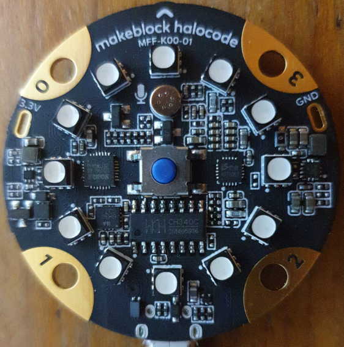

# halocode-tools

Upload script for the [makeblock halocode MFF-K00-01](https://en.wikipedia.org/wiki/Makeblock#1.6_Makeblock_Halocode)   
Source code has been extracted from this [project](https://github.com/FFtust/mu)

## Usage

```bash
# on linux
./upload.py samples/test.py 

# on windows
python upload.py samples\test.py 

```

## Run on python embedded
- Download Python embedded: https://www.python.org/downloads/release/python-3104/
- Unzip to `halocode-tools/python`
- Download Serial module: 
- Install Serial module to halocode-tools/python/Lib/site-packages: `python\python.exe setup.py install`
- Add `Lib`  and `Lib/site-packages` to `halocode-tools/python/pythonXX._pth`
- Run `python\python.exe upload.py samples\test.py`

## Links

- [Python Mu Editor for halocode](http://docs.makeblock.com/halocode/en/tutorials/use-python-mu.html)
- [Python Mu Editor original](https://codewith.mu/)
- [halocode API reference](http://docs.makeblock.com/halocode/en/block-reference/block-reference.html)

## Picture


